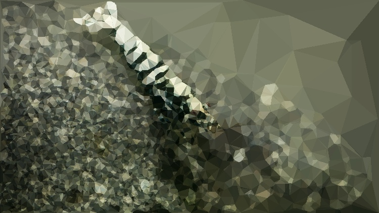

This just stores a low-poly image that I got from a Bash Script. I use it on [my website](https://madhavmalhotra.com/full-portfolio). 
See [this video](https://www.loom.com/share/b6c269a05670411f9049ba65242dc889) describing the project

---------------------------

